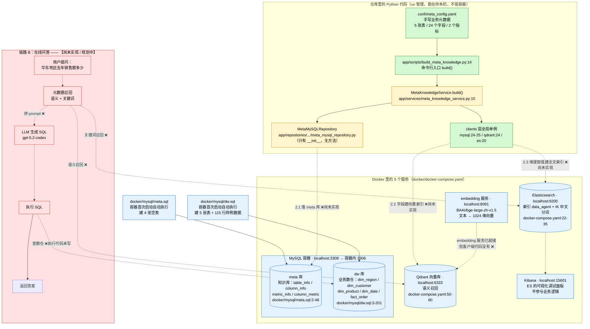

# 01 · 项目全貌：掌柜问数 data-agent 到底在干什么

> 本文是「掌柜问数 data-agent」项目解读文档的第 1 篇，面向前端开发者，假设你**不懂** MySQL / Elasticsearch / Qdrant / embedding / Docker。
> 所有结论都来自仓库真实文件，引用格式为 `文件路径:行号`。凡是代码里还没有的东西，都会显式标注 **【尚未实现 / 规划中】**，不会拿想象当现状。

---

## 1. 一句话定位

**这是一个「掌柜问数」式的 ChatBI（对话式商业智能）项目：让业务同学用中文直接问数据，由 AI 自己搞清楚该查哪张表、哪个字段，自动生成 SQL 去查数仓，最后把答案返回给他。**

用前端同学熟悉的话说：

> 它想做的，是给数据库套一个「会写 SQL 的翻译官」。
> 用户说「华东地区去年销售额多少」，翻译官要自己推断出：销售额 = 某张事实表的金额字段求和，华东 = 地区维度表里的大区字段过滤，去年 = 时间维度表的年份过滤，然后拼出一条 SQL 去查库。
>
> 这个「翻译官」不是一个纯大模型，而是一套**带知识库的系统**：先把数据库的「业务含义」整理成一份 AI 能检索的资料（本项目当前的全部工作都在这里），再让 AI 基于检索到的资料生成 SQL。

### 1.1 上游交付了一份「假想的业务数据」

仓库里已经准备好了一个小型的电商数仓样例，用来做后续验证：

- 5 张业务表：`dim_region`（地区维度，6 行）、`dim_customer`（客户维度，20 行）、`dim_product`（商品维度，15 行）、`dim_date`（时间维度，90 行）、`fact_order`（订单事实表，115 行）—— 建表见 `docker/mysql/dw.sql:8-201`。
- 4 张维度表共 6 + 20 + 15 + 90 行样例数据（`docker/mysql/dw.sql:17-23`、`:35-55`、`:68-83`、`:97-187`）。
- 事实表 `fact_order` 共 115 行订单数据（`docker/mysql/dw.sql:203-318`）。

然后，业务侧手写了一份「这份数据的中文含义」说明书：`conf/meta_config.yaml`（176 行），里面写清了每张表、每个字段的中文描述和**业务别名**。例如：

```yaml
# conf/meta_config.yaml:18-22
     - name: region_name
       role: dimension
       description: 订单所属的大区名称，如华东、华南等。
       alias: [地区, 区域, 大区]
       sync: true
```

```yaml
# conf/meta_config.yaml:160-164
     - name: order_amount
       role: measure
       description: 订单金额。
       alias: [销售额, 订单金额, 收入]
       sync: false
```

还有两个指标定义（`conf/meta_config.yaml:166-176`）：`GMV`（成交总额）和 `AOV`（平均订单金额）。

**这份 yaml 是整个项目的「钥匙」**，后面第 4 节讲为什么。

> 术语小抄：**数仓（数据仓库）** 不是一种新技术，就是「专门给分析用的数据库」。和业务库的区别是：业务库按订单/用户一条条存，方便写入；数仓按「事实 + 维度」组织，方便多维聚合查询（按地区/时间/品类任意维度求和）。`fact_` 开头的是事实表（放可累加的数字，如数量、金额），`dim_` 开头的是维度表（放描述性属性，如地区名、品类名）。

---

## 2. 先补 6 个概念，用前端能懂的方式

| 技术 | 一句话是什么 | 前端类比 |
|---|---|---|
| **MySQL** | 关系型数据库，数据存在「表」里，用 SQL 查询 | 像一堆能互相 JOIN 的 Excel 工作表；`CREATE TABLE` 像定义 TS interface，`INSERT` 像 push 数据进数组 |
| **Docker** | 把「程序 + 运行环境」打包成镜像，一次打包、到处运行 | 像前端把 `node_modules` + 运行时一起打成镜像，交付后 `docker compose up` 就起来了，不用配环境；本项目 5 个服务都是一条命令拉起（`docker/docker-compose.yaml`） |
| **Elasticsearch (ES)** | 专门做「文本搜索」的数据库，擅长中文分词和关键词匹配 | 像加强版的 `Array.prototype.filter` + 全文检索：搜「华东」能命中「华东」这个词，但**不理解**「华东」和「大区」是近义 |
| **Qdrant** | **向量数据库**，存的是「语义向量」，按语义相近程度找 | 像「语义模糊匹配」：搜「大区」能命中「region_name」，即使字面上一个字都不一样 |
| **embedding（嵌入）** | 把一句话变成一串数字（向量），语义相近的句子数字也相近 | 像把每个字符串 hash 成一串定长数组，但要求「意思像 → 数组也像」。本项目用 `BAAI/bge-large-zh-v1.5` 模型，输出 **1024** 维向量（`conf/app_config.yaml:31-34`、`:29`） |
| **Kibana** | Elasticsearch 的官方可视化控制台（网页） | 相当于给你一个 DevTools 面板，能直接在网页上查 ES 里的数据，纯运维/调试用，**不参与**业务逻辑（`docker/docker-compose.yaml:37-48`） |

---

## 3. 核心问题：为什么不能把数据库结构直接丢给大模型？

这是理解整个项目分层设计的钥匙，值得花 2 分钟。

**直觉方案（错的）**：把 5 张表的 DDL 全贴进 prompt，让大模型看着写 SQL。

**为什么不行**：大模型不认识「业务黑话」。真实业务里，用户不会说「查 `region_name` 等于华东的 `order_amount` 之和」，用户说的是：

> 「华东大区去年销售额多少？」

要让模型生成正确 SQL，得先做两层翻译：

| 用户说的话 | 数据库里的东西 | 谁来做翻译 |
|---|---|---|
| 华东 | `dim_region.region_name = '华东'` | 维度字段的**取值**（枚举值）必须提前索引，见 `conf/meta_config.yaml:20-22` |
| 销售额 | `fact_order.order_amount` | 字段**业务别名**，见 `conf/meta_config.yaml:163` |
| 大区 | `dim_region.region_name` | 字段别名 + **语义**相近，见 `conf/meta_config.yaml:21` |
| 去年 | `dim_date.year` | 字段别名 + 时间维度，见 `conf/meta_config.yaml:96-100` |
| 「先按地区汇总再算平均」 | JOIN 关系 + 指标定义 | 指标/口径知识，见 `conf/meta_config.yaml:166-176` |

所以项目引入了**元数据知识库（meta knowledge）** —— 把所有「业务黑话 ↔ 物理表字段」的对应关系，提前整理成 AI 可检索的形式，存进三个地方：

1. **MySQL 的 `meta` 库**：结构化地存表/字段/指标/关联关系，方便精确查询和人工核对（建表见 `docker/mysql/meta.sql:7-48`）。
2. **Qdrant 向量库**：把字段描述和别名做成向量，支持**语义召回**（用户说「大区」，向量上离「region_name 订单所属的大区名称」很近）。
3. **Elasticsearch 索引**：把维度字段的**真实取值**（华东、华南、黄金、苹果、手机数码……）灌进去，支持**关键词精确召回**（用户说「华东」，能确认这个值真实存在）。

> 一句话总结分工：**Qdrant 负责「猜你指的是哪个字段」，ES 负责「确认你提的值真的存在」，MySQL meta 库负责「结构化地记住这一切」。**

作者在配置里已经把这个意图标出来了：`conf/meta_config.yaml` 里 24 个字段每个都有一个 `sync: true/false` 开关（我数过：`sync: true` 共 10 个，`sync: false` 共 14 个）。**`sync: true` 的字段，就是将来要抽取它的全部取值灌进 ES 的维度字段**。看规律：

- **`sync: true`（10 个）全是「需要被过滤 / 分组的中文维度」**：`province`(:16)、`region_name`(:22)、`country`(:28)、`customer_name`(:44)、`gender`(:50)、`member_level`(:56)、`product_name`(:72)、`category`(:78)、`brand`(:84)、`quarter`(:106)。
- **`sync: false`（14 个）是主键、外键、度量值**，例如 `region_id`(:10)、`order_id`(:128)、`order_quantity`(:158)、`order_amount`(:164)、`customer_id`(:38) 等。

⚠️ 但这里有个值得留意的例外：**`dim_date` 的 `year`(:100)、`month`(:112)、`day`(:118) 也标成了 `sync: false`**，只有 `quarter`(:106) 是 `true`。也就是说，将来 ES 里不会有「2025」「3」这些时间取值 —— 但用户问「去年」（需求原文的示例问题就是「华东地区去年销售额多少」）时，恰恰需要按年过滤。这可能是设计选择（时间条件由 LLM 按 `dim_date` 的结构直接推），也可能是**待修正的标记**；当前没有任何代码能验证，这里只做提示。

---

## 4. 分层架构表

项目的目录结构就是它的分层设计。仓库第一方源码一共只有 **29 个 `.py` 文件 + 3 个 yaml + 2 个 sql**，而且其中 **14 个 `.py` 是 0 字节的空 `__init__.py`**，真正有内容的只有 **15 个**：

```
main.py                         ← 空壳入口（5 行）
app/
  conf/          2 个有内容    配置的「类型定义 + 加载」
  core/          1 个有内容    日志
  clients/       3 个有内容    外部服务的连接管理
  models/        5 个有内容    ORM 实体（表的 Python 映射）
  repositories/  1 个有内容（其余 6 个目录全是空 __init__.py）  数据访问
  services/      1 个有内容    业务编排
  scripts/       1 个有内容    命令行入口
conf/            3 个文件      实际配置文件（2 个 yaml + 1 个空 __init__.py）
docker/          基础设施（compose + Dockerfile + 2 个初始化 SQL + 本地 embedding 模型）
```

| 层 | 目录 | 职责（前端类比） | 现状 |
|---|---|---|---|
| **conf（配置）** | `app/conf/`、`conf/` | 用 `@dataclass` 声明配置结构，用 OmegaConf 把 YAML 读成强类型对象。类比：`zod` / `io-ts` 的 schema + 校验 + 解析 | ✅ **已实现且可用**（`app/conf/app_config.py:6-70`、`app/conf/meta_config.py:4-29`） |
| **core（日志）** | `app/core/log.py` | 用 loguru 统一日志：控制台 + 文件双写，10MB 轮转、保留 7 天，编码 utf-8。类比：自己封装的 logger 中间件 | ✅ **已实现且可用**（`app/core/log.py:8-28`） |
| **clients（连接管理）** | `app/clients/` | 管理到 MySQL / Qdrant / ES 的连接池，并导出**全局单例**供全项目复用。类比：axios 实例 + interceptor 单例 | ⚠️ **连接管理已实现；但每个文件底部的 `__main__` 都是 demo 测试代码**（见第 6 节） |
| **models（ORM 实体）** | `app/models/` | 把 `meta` 库的 4 张表映射成 Python 类。类比：数据库表 ↔ TS 类型/Prisma model | ⚠️ **有定义、无使用**（`app/models/table_info.py:6-25` 等 4 个实体 + `app/models/base.py:3-4`），当前没有任何代码 import 它们 |
| **repositories（数据访问）** | `app/repositories/` | 封装所有 SQL/查询，只暴露方法给 service 层。类比：`api/` 层里只负责发请求的函数 | ❌ **基本是空壳**：`app/repositories/mysql/meta/meta_mysql_repository.py` 只有 7 行、只有一个 `__init__` 存 session，**没有任何方法**；`es/`、`mysql/dw/`、`qdrant/` 三个目录里**只有 0 字节的 `__init__.py`** |
| **services（业务编排）** | `app/services/` | 编排业务流程，调用多个 repository/client。类比：页面级的业务 hooks / store action | ⚠️ **只有 1 个类 `MetaKnowledgeService`，方法体全是 `pass` + 注释 TODO**（`app/services/meta_knowledge_service.py:21-38`） |
| **scripts（命令行入口）** | `app/scripts/` | 一次性任务的可执行入口。类比：`npm run xxx` 的脚本 | ✅ **入口已跑通**（`app/scripts/build_meta_knowledge.py:14-21`、`:23-36`），但它调用的 service 是空的 |
| **docker（基础设施）** | `docker/` | 5 个服务的编排 + 初始化 SQL + 本地 embedding 模型文件 | ✅ **配置完整**（`docker/docker-compose.yaml:1-80`），MySQL 初始化脚本会自动执行（挂载在 `/docker-entrypoint-initdb.d`，`docker/docker-compose.yaml:15`） |

### 4.1 还有一个「配置了但完全没接线」的层

`conf/app_config.yaml` 里配置了 LLM，但代码里**一行都没用过**：

```yaml
# conf/app_config.yaml:41-44
llm:
 model_name: gpt-5.2-codex
 api_key: <api_key>
 base_url: https://api.openai-proxy.org/v1
```

`LLMConfig` 被定义在 `app/conf/app_config.py:51-55` 并挂进了 `AppConfig`（`app/conf/app_config.py:65`），但对整个仓库做全文搜索，`LLM` 只出现在这两处定义里，**没有任何 client / service 使用它**。

同样「装了依赖但没用上」的还有 `pyproject.toml:5-19` 里的：

- `fastapi`（HTTP API 框架）—— **没有** 任何 `FastAPI()` 实例、没有路由文件，说明「对外提供问答接口」还没开始写
- `langchain` / `langgraph`（Agent 编排）—— 代码里零引用，说明「多步骤 Agent 流程」还在规划
- `jieba`（中文分词）—— 代码里零引用，对应「2.3 维度取值建全文索引」那一步（中文分词后才能灌 ES）
- `langchain-huggingface` —— 代码里零引用，对应「2.2 字段建向量索引」那一步

**这四条依赖就是作者对后续章节的路线图**：用 langgraph 编排 Agent，用 jieba 分词，用 huggingface 客户端调 embedding，用 FastAPI 暴露接口。

---

## 5. 端到端数据流

项目有两条链路，一条**离线**（建知识库），一条**在线**（回答问题）。

### 链路 A：离线建库（代码骨架已搭好，内部未实现）

触发方式：一条命令

```bash
python -m app.scripts.build_meta_knowledge -c conf/meta_config.yaml
# 参数定义见 app/scripts/build_meta_knowledge.py:31
# 入口调用见 app/scripts/build_meta_knowledge.py:36
```

流程逐步拆解：

```
① conf/meta_config.yaml
   └─ 手写的业务元数据：5 张表 / 24 个字段 / 2 个指标
      文件: conf/meta_config.yaml:1-176

② app/scripts/build_meta_knowledge.py:14 build(config_path)
   ├─ meta_mysql_client_manager.init()                  :15  建立 MySQL 连接池（连 meta 库）
   ├─ async with ...session_factory() as session        :16  开一个数据库会话
   ├─ MetaMySQLRepository(session)                      :17  包成 repository（当前是个空壳）
   ├─ MetaKnowledgeService(meta_mysql_repository)       :18  注入依赖，构造 service
   └─ await meta_knowledge_service.build(config_path)   :19  ← 真正的核心逻辑，目前是空的

③ app/services/meta_knowledge_service.py:10 build()
   ├─ 读取 + 校验配置                                     :12-16
   │    OmegaConf.load → 读 yaml
   │    OmegaConf.structured(MetaConfig) → 拿 dataclass 当 schema
   │    OmegaConf.merge → schema 打底 + yaml 覆盖（字段名写错/类型不对直接报错）
   │    OmegaConf.to_object → 转成真正的 MetaConfig 实例
   ├─ print(meta_config.metrics)                         :18  ← 唯一实际执行的一行（调试用打印）
   │
   ├─ 2.1 表信息 / 字段信息 → 写 meta 库                   :22-27  ❌ 内部是 pass
   ├─ 2.2 字段信息 → 建向量索引（写 Qdrant）                :29     ❌ 只有注释，没有代码
   ├─ 2.3 指定维度字段的取值 → 建全文索引（写 ES）           :31-32  ❌ 内部是 pass
   ├─ 3.1 指标信息 → 写 meta 库                            :36-38  ❌ 内部是 pass
   └─ 3.2 指标信息 → 建向量索引                            :37     ❌ 只有注释
```

**验收方式也很直白**：这段代码目前跑完，除了 `③:18` 那行 `print` 打印出两个指标对象，**不会向任何数据库写一个字节**。作者自己在源码里留下的 TODO 编号（2.1 / 2.2 / 2.3 / 3.1 / 3.2）就是接下来要实现的任务清单。

侧面证据：`logs/app.log:1-2` 记录过两次 `build()` 执行（`2026-09-20`），但当前源码里 `build()` 内部**并没有任何 `logger.info` 调用** —— 说明日志是更早一版代码留下的，脚本确实被真实运行过，只是那版才有的日志语句后来被删了。

**这条链路最终要产出的三份数据**（也就是「元数据知识库」）：

| 产出 | 存放位置 | 内容 | 用途 |
|---|---|---|---|
| 表/字段/指标结构化信息 | MySQL `meta` 库的 `table_info` / `column_info` / `metric_info` / `column_metric` 四张表（`docker/mysql/meta.sql:7-48`） | 表名、字段名、类型、角色、描述、别名、示例值 | 精确查询、人工核对、给 LLM 拼上下文 |
| 字段语义向量 | Qdrant 里的一个 collection（**尚未实现**；配置里 `embedding_size: 1024`，`conf/app_config.yaml:29`） | 每条 = 一段字段描述文本的 1024 维向量 + payload | 语义召回：用户说「大区」→ 命中 `region_name` |
| 维度取值全文索引 | ES 的 `data_agent` 索引（**尚未实现**；配置 `conf/app_config.yaml:39`） | `sync: true` 字段的真实取值（华东/华南/黄金/苹果……） | 关键词召回：用户说「华东」→ 确认该值存在并定位到 `dim_region.region_name` |

### 链路 B：在线问答（【尚未实现 / 规划中】）

**这条链路在仓库里一行代码都没有。** 下面是从现有配置和依赖反推出来的目标设计，每个环节都标注了证据来源和实现状态：

```
用户在页面输入：「华东地区去年销售额多少」
    │
    ▼
① 【规划中】HTTP 接口收到问题          ← pyproject.toml:9 装了 fastapi，但无任何 FastAPI 代码
    │
    ▼
② 【规划中】元数据召回
    ├─ 语义召回：问题向量 → 查 Qdrant → 命中 fact_order.order_amount / dim_region.region_name
    │   证据：配置了 Qdrant(conf/app_config.yaml:26-29) + embedding 服务(:31-34)
    │   依赖：pyproject.toml:12 langchain、:13 langgraph、:14 langchain-huggingface
    └─ 关键词召回：问题里的「华东」→ 查 ES → 确认是 dim_region.region_name 的取值
        证据：ES 索引名 data_agent(conf/app_config.yaml:39) + IK 中文分词插件(docker/elasticsearch/Dockerfile:5-8)
        依赖：pyproject.toml:10 jieba
    │
    ▼
③ 【规划中】拼 prompt 交给 LLM 生成 SQL
    ├─ 输入：用户问题 + 召回的表/字段/指标/取值
    ├─ 模型：gpt-5.2-codex（conf/app_config.yaml:42），走 openai-proxy 代理(:44)
    └─ 依赖：需要新建 LLM client（当前 app/clients/ 下只有 mysql / qdrant / es 三个）
    │
    ▼
④ 【规划中】执行 SQL：连 dw 库跑查询
    ├─ 连接已就绪：dw_mysql_client_manager（app/clients/mysql_client_manager.py:25）
    └─ 但 repositories/mysql/dw/ 目录里只有 0 字节的 __init__.py，没有任何执行代码
    │
    ▼
⑤ 【规划中】把结果集返回前端渲染（表格/图表）
```

⚠️ **特别提醒**：`app/clients/mysql_client_manager.py:25` 导出的 `dw_mysql_client_manager` 让「④」看起来很近，但从「能连上库」到「能安全执行 LLM 生成的 SQL」还隔着 3 件事：SQL 校验白名单、查询超时/行数限制、以及把结果结构化。这些目前都是**空白**。

---

## 6. 一张图看懂两条链路 + 5 个 Docker 服务



**图例说明**：🟩 绿色 = 已实现可用；🟨 黄色 = 有骨架但核心为空；🟥 红色 = 完全没有实现（规划中）；🟦 蓝色 = 基础设施（Docker 服务 + 初始化好的数据）。
**实线** = 代码里真实存在的调用；**虚线** = 目标设计 / 尚未实现。

### 6.1 meta 库 vs dw 库的分工（最容易搞混的一点）

两者在**同一个 MySQL 容器**里（都是 `localhost:3308`，`conf/app_config.yaml:12-24`），但职责完全不同：

| | `meta` 库 | `dw` 库 |
|---|---|---|
| 存什么 | **关于数据的数据**（元数据）：表叫什么、字段什么意思、别名是什么、指标怎么算 | 真正的**业务数据**：一行行订单、一个个客户 |
| 打个比方 | 图书馆的**索引卡片**（告诉你「烹饪类在第 3 排」，卡片本身不是书） | 书架上**真正的书** |
| 谁写入 | 由本项目 `build_meta_knowledge.py` 生成（**尚未实现**）；建表 SQL 见 `docker/mysql/meta.sql` | 由上游业务系统/ETL 写入；本项目**只读**。样例数据见 `docker/mysql/dw.sql` |
| 谁查询 | 链路 A 写入、链路 B 读取（都未实现） | 链路 B 最后一步执行 SQL 的地方（未实现） |
| 代码里的连接 | `meta_mysql_client_manager`（`app/clients/mysql_client_manager.py:24`） | `dw_mysql_client_manager`（`app/clients/mysql_client_manager.py:25`） |

**一句话**：`meta` 库是给 **AI** 看的（帮它理解 dw 里有什么），`dw` 库是给 **用户** 看的（最终答案的数据来源）。两个 client 单例被并列定义在同一个文件里，正是这个分层的体现。

---

## 7. 现状盘点（诚实版，不美化）

### ✅ 已经实现且真正可用的（5 类）

| 项 | 证据 | 说明 |
|---|---|---|
| 配置加载体系 | `app/conf/app_config.py:6-70`、`app/conf/meta_config.py:4-29`、`conf/app_config.yaml`、`conf/meta_config.yaml` | dataclass 定义结构 + OmegaConf 校验并转对象。**真的能跑**，字段名写错会直接报错 |
| 日志体系 | `app/core/log.py:8-28` | loguru 双写（stdout + `logs/app.log`），轮转/保留/utf-8 编码都配好了。`logs/app.log:1-2` 证明它工作过 |
| 三个外部服务的连接管理 | `app/clients/mysql_client_manager.py:6-25`、`app/clients/qdrant_client_manager.py:7-24`、`app/clients/es_client_manager.py:6-20` | 连接池 + 全局单例都写好了。MySQL 还配了 `pool_size=10` 和 `pool_pre_ping`（`app/clients/mysql_client_manager.py:18`） |
| Docker 基础设施 + 样例数据 | `docker/docker-compose.yaml:1-80`、`docker/mysql/dw.sql`（318 行）、`docker/mysql/meta.sql`（48 行）、`docker/elasticsearch/Dockerfile:1-12` | 5 个服务编排完整，含内存/CPU 限制；MySQL 初始化 SQL 会自动执行；ES 预装了 IK 中文分词插件并已把插件 zip 放进仓库（`docker/elasticsearch/plugins/elasticsearch-analysis-ik-8.19.10.zip`）；embedding 模型权重也放进了仓库（`docker/embedding/bge-large-zh-v1.5/`）并被挂载进容器（`docker/docker-compose.yaml:73`），**不需要联网下载模型**（不过首次启动仍需拉取 MySQL/Kibana/Qdrant 镜像，并本地构建 ES 镜像） |
| 核心业务元数据 | `conf/meta_config.yaml:1-176` | 这份手写 yaml 是实打实的业务资产，不是占位符 |

### 🟡 有骨架但核心是空壳的

| 项 | 证据 | 缺什么 |
|---|---|---|
| `MetaKnowledgeService.build()` | `app/services/meta_knowledge_service.py:10-40` | 配置读取部分（`:12-16`）**已实现**；`2.1`(:22-27)、`2.3`(:31-32)、`3.1`(:36-38) 全是 `pass`；`2.2`(:29)、`3.2`(:37) 只有注释，连 `pass` 都没有。唯一真正执行的是 `:18` 的一行 `print` |
| CLI 入口 | `app/scripts/build_meta_knowledge.py:14-21`、`:23-36` | 参数解析（`-c/--conf`）、依赖注入、`asyncio.run` 都通；但它调用的 service 是空的，所以**跑完等于什么都没干**。另外 `:7` import 了 `logger` 却从未使用 |
| ORM 实体 | `app/models/table_info.py:6-25`、`app/models/column_info.py:7-42`、`app/models/metric_info.py:7-30`、`app/models/column_metric.py:6-18` | 4 个实体和 `meta.sql` 的 4 张表**字段完全对得上**（逐个比对：`meta.sql:8-14` ↔ `table_info.py:9-24` 等），但**没有任何代码 import 它们**。所以它们目前是「写好了但没接线的类型定义」 |
| `MetaMySQLRepository` | `app/repositories/mysql/meta/meta_mysql_repository.py:4-7` | 只有 `__init__` 存了 session，**一个方法都没有** |

### ❌ 完全是空目录 / 空文件

| 目录 | 内容 |
|---|---|
| `app/repositories/es/` | 只有 0 字节 `__init__.py` |
| `app/repositories/mysql/dw/` | 只有 0 字节 `__init__.py` |
| `app/repositories/qdrant/` | 只有 0 字节 `__init__.py` |
| `main.py` | 5 行，只有 3 句 `logger.info/warning/error` 演示（`main.py:1-5`），**不是真正的入口**，也不被任何东西引用 |

### 🧪 demo / 测试代码（跑得通，但不是产品逻辑）

这三个文件的文件末尾都挂着 `if __name__ == "__main__":` 的独立测试块，用 `python 文件路径` 直接跑就能自测。**读代码时不要把它们当业务逻辑**：

| 文件 | demo 内容 | 为什么说是 demo |
|---|---|---|
| `app/clients/mysql_client_manager.py:27-41` | 连 `dw` 库跑 `select * from fact_order limit 10`，打印前三行类型和值 | 硬编码 SQL；只为了验证连接池能用 |
| `app/clients/qdrant_client_manager.py:27-68` | 建一个 `test_collection_async`、塞 4 个 4 维向量（Berlin/London/Moscow/New York），再按向量查最近 2 条 | ① 集合名带 `test_` ② **向量维度用的是 4，不是配置里的 1024**（`:41`）③ 数据是城市名，和本项目业务无关。作者自己在 `:28-29` 注释里写明「正式建集合时应该用 `app_config.qdrant.embedding_size`（这里是 1024）」 |
| `app/clients/es_client_manager.py:22-51` | 建 `books` 索引、写入《Snow Crash》这本书、查出来打印 | 索引名是 `books`，而配置里写的是 `data_agent`（`conf/app_config.yaml:39`）；数据是英文书籍，和本项目无关 |

### 📋 规划中，代码一行都没有

- **整个在线问答链路（链路 B）**：无 HTTP 接口、无召回逻辑、无 LLM 调用、无 SQL 执行、无结果返回（详见第 5 节）。
- **embedding 客户端**：`app/clients/` 下只有 mysql / qdrant / es 三个 manager，**没有** embedding manager。
- **LLM 客户端**：`LLMConfig` 定义在 `app/conf/app_config.py:51-55`，但全仓库零使用（grep 只命中定义处）。
- **API 层**：`pyproject.toml:9` 装了 fastapi，但没有任何 FastAPI 应用代码。

### ⚠️ 读代码时值得注意的两个细节

1. **配置与 ORM 实体之间有一处「规格差」**：`conf/meta_config.yaml` 的字段只提供 `name / role / description / alias / sync`（`app/conf/meta_config.py:5-10`），但 `column_info` 表里还有 `type`（数据类型）和 `examples`（数据示例）两列（`docker/mysql/meta.sql:19-26`、`app/models/column_info.py:19-30`）。**这两列的数据从哪来？** 配置文件里没有。合理的推断是将来要从 `dw` 库的真实结构去探测（比如读 `information_schema`、抽样取值），但**相关代码尚未实现**，这里只是指出缺口，不是结论。
2. **`AOV` 指标定义内部不自洽**：`AOV` 的描述是「所有订单的**成交金额**平均值」（`conf/meta_config.yaml:173`），但 `relevant_columns` 指向的是 `fact_order.order_quantity`（`conf/meta_config.yaml:175`），也就是「数量」字段。按描述它应该指向 `fact_order.order_amount`。这可能是笔误，也可能是刻意设计（比如口径是「平均每单件数」），**当前没有代码能验证**，留给后续章节确认。

---

## 8. 三句话带走

1. **它在干什么**：做一个中文自然语言查数仓的 AI 助手。用户问「华东地区去年销售额多少」，系统自己搞清楚要查 `fact_order.order_amount` + `dim_region.region_name` + `dim_date.year`，生成 SQL 去查 `dw` 库。
2. **它的核心设计**：不能把数据库结构直接丢给大模型（模型不懂业务黑话），所以要先建一个「元数据知识库」——用 **MySQL `meta` 库**存结构化定义、用 **Qdrant** 做语义召回、用 **Elasticsearch + IK 分词**做取值关键词召回。
3. **它现在的进度**：**基础设施和配置齐了，核心逻辑一点没写。** 5 个 Docker 服务、5 张业务表、115 行样例数据、176 行业务元数据、3 个连接管理器都就绪；`MetaKnowledgeService.build()` 里 5 个 TODO（2.1 / 2.2 / 2.3 / 3.1 / 3.2）全是 `pass`，在线问答链路一行代码都没有。当前处于典型的**「骨架搭好、等你填肉」阶段**。

---

### 附：如何自己验证本文的结论

```bash
# 1. 看目录结构：29 个 py 文件，其中 14 个是 0 字节的空 __init__.py
#    排除 .venv 和 .git，否则结果会被淹没

# 2. 验证「核心逻辑是空的」
#    读 app/services/meta_knowledge_service.py:22-38，数一数几个 pass

# 3. 验证「LLM 配置没接线」
#    全仓库搜索 LLMConfig / llm，只会在 app/conf/app_config.py 命中 2 处定义

# 4. 验证「3 个 client 的单例」
#    app/clients/mysql_client_manager.py:24-25（meta + dw 两个）
#    app/clients/qdrant_client_manager.py:24
#    app/clients/es_client_manager.py:20

# 5. 起基础设施（可选，需要装 Docker）
docker compose -f docker/docker-compose.yaml up -d
```

**下一篇**建议从 `docs/project-explained/02-config.md`（配置层）开始读，那里会拆解 `app_config.yaml` 和 `meta_config.yaml` 的每一个字段。
